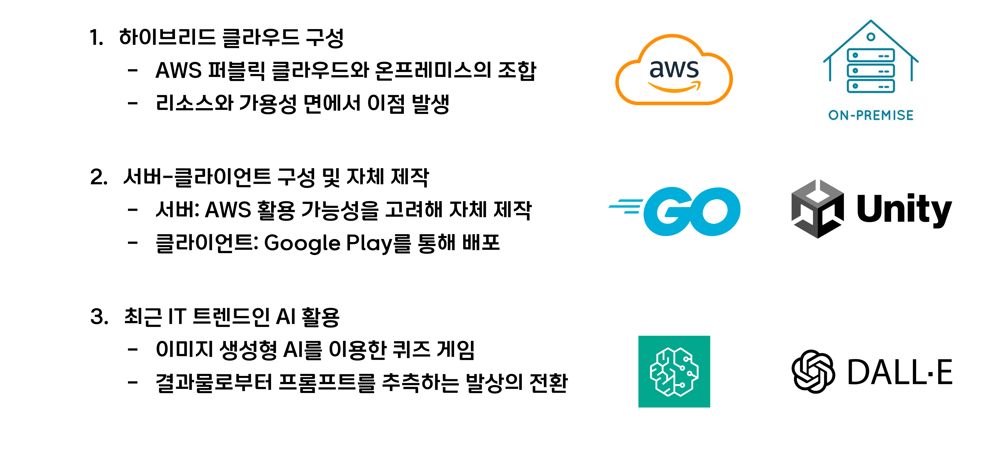
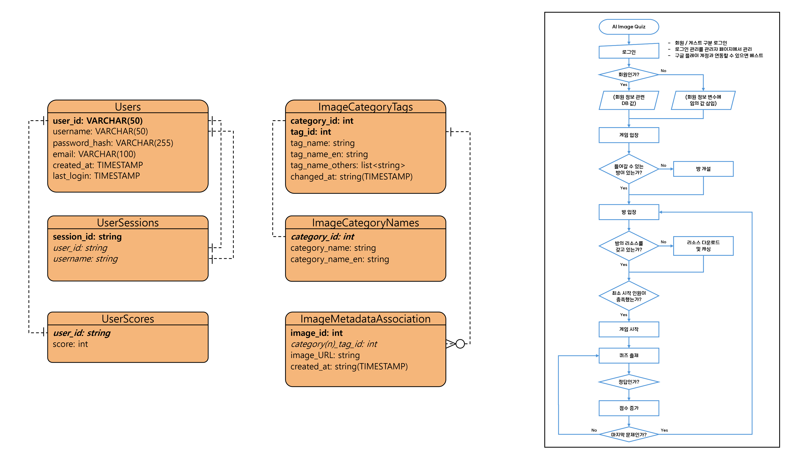
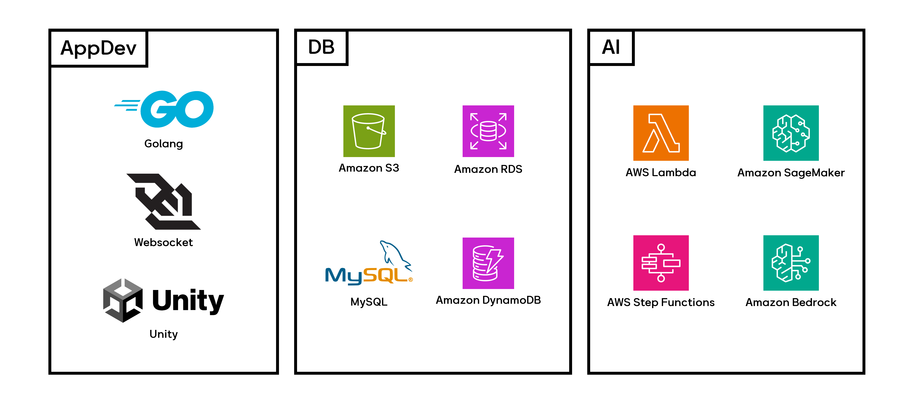
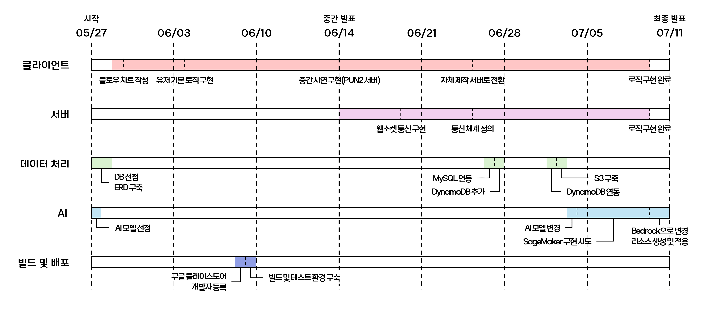
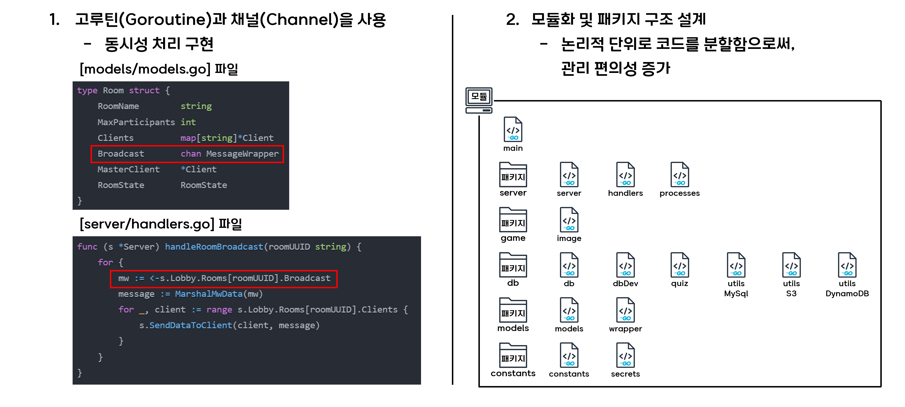
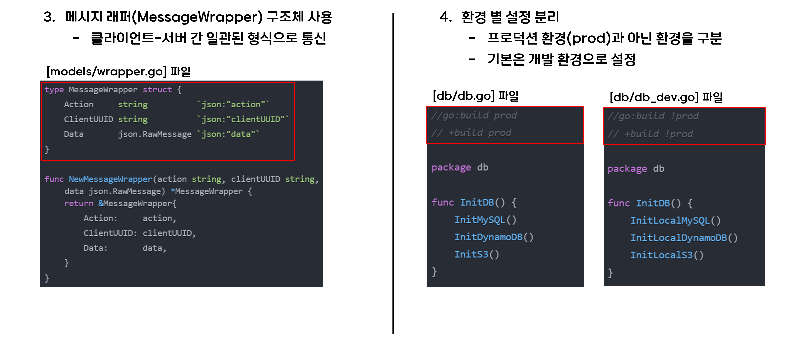
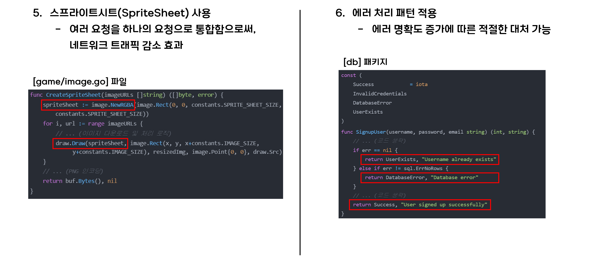
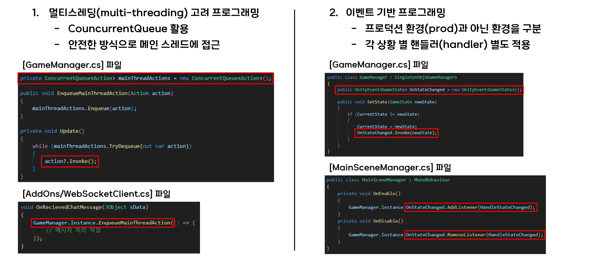
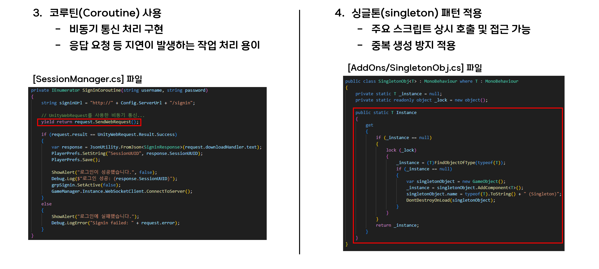
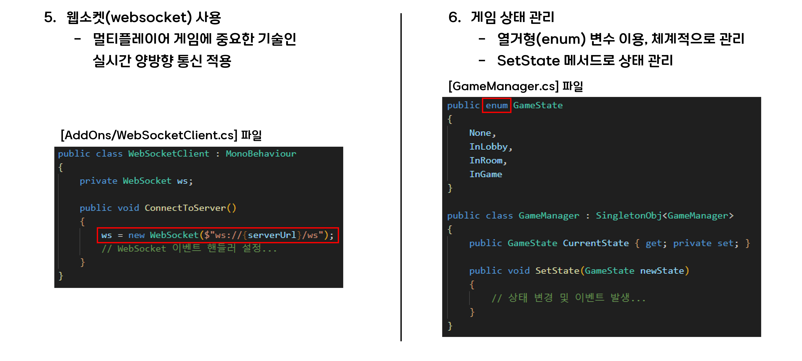

# AI-Image-Quiz-public
## Description(ko-kr)
### Keyword: 'AI'
<strong>'AI'</strong>라는 키워드는 IT 계열에서 관심도가 나날이 상승하고 있는 분야임에 논란의 여지가 없다. 요즘의 트렌드인 **AI**를 주제 삼아 만들 수 있는 게임이 어떤 게 있을까 고민해봤다.

### 발상의 전환
사람이 **AI**에게 프롬프트 같은 방식으로 질문을 해 답을 얻는 게 상용화된 인공 지능의 형태이고, 정작 **AI**가 어떻게 사고하는지는 인간의 사고로는 범접할 수 없는 수준이었다. **여기서 발상을 뒤집어봤다.** 과연 **AI**가 만들어 낸 결과물을 퀴즈의 소재로 사용한다면, 사람들은 맞출 수 있을까? 때로는 <strong>"이야, 이렇게도 문제를 낼 수가 있구나."</strong>하며 흥미를 느끼기도 좋을 것이라고 생각했다.

### 아이디어
"**LLM(Large Language Model)** 대상 스무고개", "**이미지 생성형 AI** 대상 이미지 퀴즈" 두 가지 아이디어가 먼저 번뜩였는데, 몇몇 모델을 대상으로 테스트 해 본 결과 스무고개는 지루한 감이 있었다. 그렇게 선정하게 된 <strong>**"AI 이미지 퀴즈"**</strong>가 이번 프로젝트이다.

### 초기 전략
처음엔 ***키워드***와 ***키워드가 씌워질 프롬프트***만 사전에 제공한 뒤 키워드를 랜덤하게 뽑아 이미지를 즉석에서 만들어서 보여주고 싶었다. 하지만, **이미지 생성형 AI** 기준으로 이미지를 하나 생성할 때마다 비용이 발생했고, 응답이 빠를 때조차 이미지를 생성하는 시간이 최소 2초는 걸렸다. 응답 속도가 느릴 때는 얼마나 더 걸릴지 모르고, 게임 운영을 도박수로 할 순 없었기에 수정해야만 했다.

### 최종 전략
클라우드 단에서 **AWS Lambda**와 **AWS Step Functions**를 활용해 사전에 제공된 키워드들로 미리 이미지를 만들어 **Amazon S3**에 저장하고, 해당 개체에 접근할 수 있는 URL를 **DynamoDB**에 제공한다. 게임이 진행될 때 특정 로직에 따라 **DynamoDB**에 랜덤하게 접근해 URL을 얻고 보여주기만 하는 방향으로 변경했다.

### 추후 보완점
지금의 로직은 같은 이미지를 같은 사용자가 또 보게 될 가능성이 존재한다. 이 경우 답을 다 알고 문제를 진행할 수도 있기에 형평성에 어긋난다.
현재 아이디어로써 대응점은 두 가지 존재한다.
- 이미지 사용 빈도 또는 기간에 따라 교체
  - 상세
    - **Amazon EventBridge**를 이용해 특정 주기마다 이미지 액세스 횟수 또는 생성 날짜를 스캔, 각 이미지가 사전에 지정한 특정 횟수 또는 유지 기간을 넘긴 경우 새로운 이미지로 생성해 덮어쓰기
  - 쟁점
    - 기간으로 정할 시, 사용되지도 않은 그림이 새로 만들어지는 개수가 많아질 것이고 이는 비용적 손실로 이어짐
    - 기존 보완점이었던 같은 이미지를 보게 될 가능성에 대해서는 본질적으로 해결되지 않았음
- 이미지 호출 체계 구조화
  - 상세
    - 이미지를 호출할 때 매개변수 폭을 넓혀 한 유저가 한 번 본 이미지는 다시 보이지 않도록 하고, 더는 보여줄 사진이 존재하지 않는 경우가 발생하면 새로운 이미지 버전을 만들어 해당 사용자는 다른 버전의 이미지에 접근할 수 있도록 하기
  - 쟁점
    - 사진 100개가 있을 때 5명의 유저가 각각 모두 다른 사진 20개씩 진행한 이력이 있다면, 개인별 나머지 80개의 이미지는 사용할 수 없는 게임이 되어 버림
    - 한 유저가 일반적이지 않은 수준으로 많은 게임을 진행할 경우 해당 유저만을 위한 이미지가 생성돼야 할 수도 있음
    - 제일 중요한 건, 처리해야 할 로직이 많아지므로 서버 부하가 크게 늘어남

**추후 서비스가 커지면 두 개의 대응점의 장점만 뽑아내 진행해야 할 것이다.**

## Description(en-us)
The keyword **'AI'** is undeniably a rapidly growing field of interest in the IT sector. I've been pondering what kind of game could be created with the trendy theme of **AI**.

### Thinking outside the box
People commonly interact with **AI** through prompts to get answers, which is a widespread form of artificial intelligence. However, how **AI** actually thinks remains beyond human comprehension. **Here, I flipped the idea.** If we used the results generated by **AI** as quiz material, could people guess them? Sometimes, it might even be intriguing, making people think, **"Wow, you can ask questions in such a way."**

### Idea
The two initial ideas were "Twenty Questions for **LLM (Large Language Model)**" and "Image Quiz for **Image-Generating AI**". After testing a few models, the twenty questions felt monotonous. Thus, the chosen project is the **"AI Image Quiz"**.

### Initial Strategy
Initially, I wanted to provide only ***keywords*** and ***prompts for those keywords*** in advance, then randomly select a keyword to create and display the image on the spot. However, generating each image using an **image-generating AI** incurred costs, and even when responses were quick, it took at least 2 seconds to generate an image. The response time could be unpredictable, making it risky to base game operations on it, so modifications were necessary.

### Final Strategy
Using **AWS Lambda** and **AWS Step Functions** on the cloud, we pre-generate images based on provided keywords, store them in **Amazon S3**, and provide URLs to access these images in **DynamoDB**. During the game, URLs are randomly accessed from **DynamoDB** based on specific logic and displayed.

### Future Improvements
The current logic has the potential for the same user to see the same image again. This would allow users to know the answers in advance, which is unfair.
Two possible responses exist to address this issue:
- Replace images based on usage frequency or period
  - Details
    - Use **Amazon EventBridge** to scan image access counts or creation dates at specific intervals and regenerate and overwrite images that exceed a specified access count or retention period
  - Issues
    - If determined by period, many unused images will be unnecessarily regenerated, leading to cost losses
    - The fundamental issue of seeing the same image again remains unresolved
- Structure image calling system
  - Details
    - Broaden the parameter scope when calling images so that a user doesn't see the same image again, and if no more images are available, create a new version of the image, allowing the user to access different versions
  - Issues
    - If there are 100 images and 5 users have each viewed 20 different images, the remaining 80 images become unusable for each user
    - In cases where a user plays an unusually high number of games, images may need to be created specifically for that user
    - Most importantly, increasing the logic to process significantly increases server load

**As the service grows, we will need to extract and implement the advantages of both response strategies.**

## 기획
### 기획 의도(Planning intent)

### ERD(Entity Relationship Diagram) & Architecture Diagram

## 담당 기술 스택(Respnsible Tech Stack)

## 담당 파트 진행 일정(Responsible Part Progress Schedule)

## 주요 테크닉
### Golang 서버

### Unity 클라이언트

## 시연 영상
